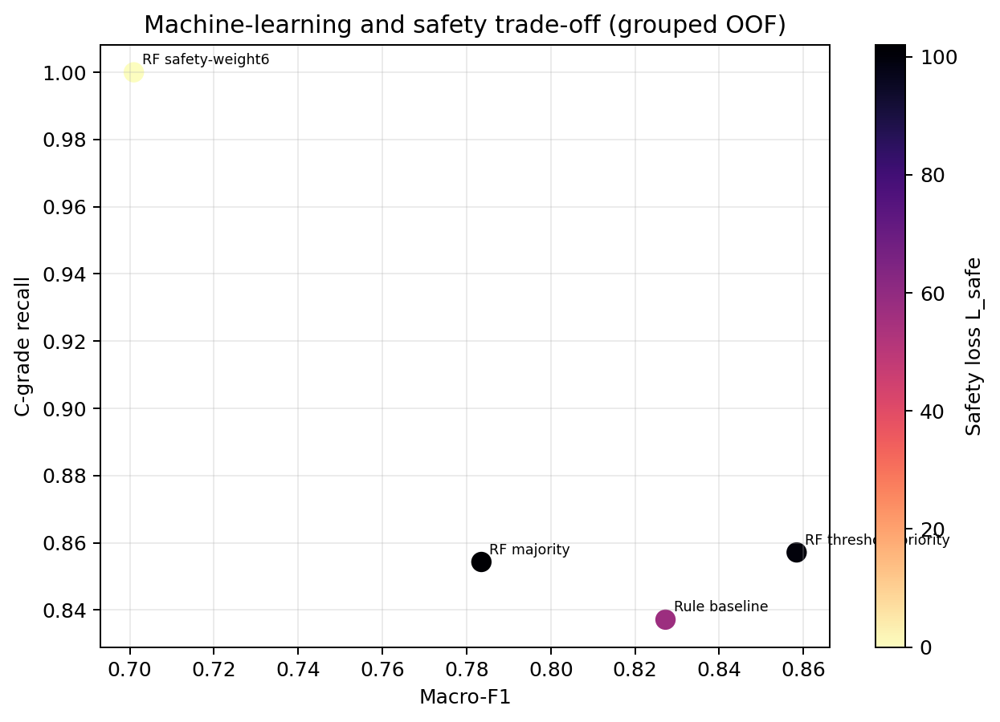

# 机器学习与Pareto初步结果报告

## 1 试验口径

本报告使用875条受控合成样本，目标等级按冻结的严重度映射产生：safe/slight为A，moderate为B，severe/critical为C。机器学习输入只使用物理和观测特征，不使用`target_mode`、`target_severity`、`grade`、`model_grade`、`score`、`rho`、`dominant_mode`和交付模型输出。

为避免相同输入的重复行同时进入训练集和测试集，按完全相同物理特征向量分组，使用五折OOF；另完成5外层×3内层的分组嵌套验证原型。当前结果仍属于合成生成器下的受控实验。

## 2 规则基线与机器学习对比

| 方案 | 准确率 | 宏平均F1 | 平衡准确率 | C级召回率 | C级低估 | C→A | A级高估 |
|---|---:|---:|---:|---:|---:|---:|---:|
| 交付规则基线 | 0.8446 | 0.8272 | 0.8467 | 0.8371 | 57 | 0 | 54 |
| 浅层决策树 | 0.7074 | 0.6456 | 0.6352 | 0.6314 | 129 | — | 0 |
| 随机森林多数投票 | 0.8286 | 0.7835 | 0.7629 | 0.8543 | 51 | 51 | 0 |
| 随机森林性能优先阈值 | 0.8731 | 0.8584 | 0.8362 | 0.8571 | 50 | 50 | 0 |
| 随机森林安全优先 C 权重6 | 0.7074 | 0.7009 | 0.6829 | 1.0000 | 0 | 0 | 179 |

## 3 Pareto目标

候选方案同时考察宏平均F1、C级召回率、C级低估、直接C→A低估、C级升级率和覆盖率。安全损失定义为：

\[
L_{safe}=2N(C\rightarrow A)+N(C\rightarrow B).
\]

性能优先点`τC=0.35、τB=0.20`提高了总体准确率和宏平均F1，但C→A直接低估由规则基线的0条增加到50条，因此不能直接作为工程发布方案。C权重6方案消除了C级低估，却产生较多A级高估，说明多目标优化的结果必须结合工程风险偏好和人工复核能力选择。

## 4 嵌套验证原型

5外层×3内层分组嵌套验证结果：准确率0.8811，宏平均F1 0.8704，平衡准确率0.8495，C级召回率0.8571，C级低估50条。外层仍出现C→A低估，说明只把C级召回率设为约束还不够，正式版本应把直接C→A低估设为硬约束或显著提高惩罚，并引入拒判/人工复核状态。

## 5 结论

当前结果已经形成了论文所需的“模型对比效果”：决策树不满足性能要求；随机森林能够改善C级召回率；Pareto阈值可以改善总体分类指标；安全优先代价权重可以消除C级低估但增加升级负担。上述增益和代价只在875受控生成机制下成立，不等于真实堤防工程预测性能。正式论文仍需独立现场标签和物理门控联动的外部验证。

## 6 物理门控混合策略

为防止机器学习策略把物理规则已经识别的风险等级降级，增加决策层物理风险下限：将A、B、C编码为0、1、2，令最终输出为`max(RF阈值输出, 交付规则最终等级)`。在同一组分五折OOF结果上，该混合策略达到准确率0.9257、宏平均F1 0.9119、平衡准确率0.9276、C级召回率1.0000，C级低估数和安全损失均为0，A级高估数为54。相对RF性能优先策略，它改变154/875条输出。

另设不确定性复核变体：当随机森林最大类别概率低于0.60时转人工复核，并以规则等级作为离线统计的回退输出。该变体有62/875（7.09%）样本进入复核，准确率0.9109、宏平均F1 0.8964、C级召回率0.9657、C→B低估12条、C→A低估0条。上述结果仍来自同一受控生成器和同一875条样本，说明的是安全门控架构的行为，不是独立工程泛化增益。

## 7 多随机种子稳健性

在不改变目标构造、输入特征排除清单、分组五折OOF、随机森林参数、阈值和物理门控规则的前提下，使用种子20260930—20260934重新生成5批875条样本。结果采用5批均值±标准差表示：

| 方案 | 准确率 | 宏平均F1 | 平衡准确率 | C级召回率 | C级低估 | 安全损失 |
|---|---:|---:|---:|---:|---:|---:|
| 交付规则基线 | 0.8473±0.0017 | 0.8298±0.0017 | 0.8490±0.0014 | 0.8417±0.0016 | 55.4±0.5 | 55.4±0.5 |
| RF性能优先阈值 | 0.8754±0.0101 | 0.8621±0.0150 | 0.8406±0.0164 | 0.8554±0.0038 | 50.6±1.3 | 101.2±2.7 |
| RF + 物理门控混合 | 0.9214±0.0042 | 0.9064±0.0051 | 0.9202±0.0062 | 0.9983±0.0038 | 0.6±1.3 | 0.6±1.3 |
| RF + 门控与复核回退 | 0.9081±0.0060 | 0.8924±0.0071 | 0.9078±0.0081 | 0.9691±0.0079 | 10.8±2.8 | 10.8±2.8 |

与同一5个种子上的规则基线配对比较，物理门控混合的准确率、宏平均F1和平衡准确率平均分别提高7.41、7.65和7.12个百分点，C级低估平均减少54.8条。多种子结果表明，相对关系在同一合成生成族内保持，但不能替代独立现场标签。逐种子数据、日志及汇总文件见`分析工作区/875多种子稳健性/`，运行脚本为`run_multi_seed_robustness.py`。

## 8 纯机器学习安全约束消融

为检验物理门控是否只是阈值调参的替代表达，另以0.01为步长遍历`τ_C`和`τ_B`的10000个纯RF阈值策略。没有任何纯RF阈值组合能够实现C→A直接低估为0；纯RF宏平均F1最高点为`τ_C=0.19, τ_B=0.06`，准确率0.8869、宏平均F1 0.8900，但仍有50条C→A低估，安全损失为100。因此，物理门控混合的零C→A结果来自显式决策层风险下限，而不是RF阈值本身。可复现实验见`run_safety_constraint_ablation.py`，结果见`safety_constraint_ablation.json`。

## 9 复核预算敏感性

对最大类别概率阈值`u=0.50—0.90`进行扫描，并在低于阈值时使用规则等级回退。5个新种子的结果为：

| 复核阈值 | 平均复核率 | 准确率 | 宏平均F1 | C级召回率 | 安全损失 |
|---:|---:|---:|---:|---:|---:|
| 0.50 | 1.53%±0.67% | 0.9177±0.0057 | 0.9025±0.0066 | 0.9903±0.0080 | 3.4±2.8 |
| 0.60 | 6.58%±0.85% | 0.9081±0.0060 | 0.8924±0.0071 | 0.9691±0.0079 | 10.8±2.8 |
| 0.70 | 15.95%±1.42% | 0.8734±0.0092 | 0.8567±0.0092 | 0.8931±0.0247 | 37.4±8.6 |

若暂定复核率不超过5%、安全损失不超过6，`u=0.50`在5个种子上均满足约束。该预算是外部验证前的协议候选，必须预先锁定，不能根据现场结果事后调节。逐种子曲线见`875多种子稳健性/review_budget_sweep.csv`和`.json`。
