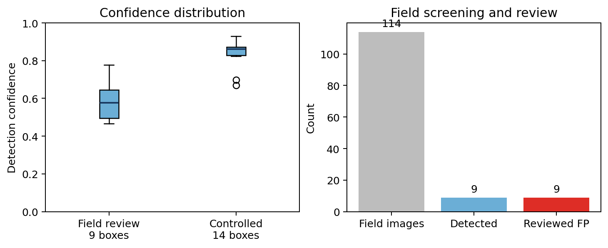

# 巡检识别资料审计与第6章接入报告

日期：2026-09-28。分析脚本：`分析工作区/audit_inspection.py`。原始目录`巡检识别`未修改，清单、提取文本和交叉核对表位于`分析工作区/巡检识别审计`。

## 1. 资料构成

目录内共376张JPG、13张PNG、22个检测标签TXT、1个复核XLSX、1份辐射温度PDF和1份资料说明DOCX。

| 数据层 | 数量 | 作用 | 当前证据性质 |
|---|---:|---|---|
| 匿名堤段匿名堤段现场红外原图 | 114张 | 现场筛查输入 | 现场巡检影像 |
| 现场检测可视化结果 | 114张 | 模型输出展示 | 推理结果 |
| 现场检测标签 | 9个文件、9个框 | 模型输出坐标和置信度 | 只有产生框的样本 |
| 现场可疑点人工复核 | 9条 | 误报/异常定性 | 9条均为误报 |
| 人造管涌验证原图 | 13张 | 受控/历史样本识别检验 | 验证集，标签语义待核 |
| 人造管涌检测标签 | 14个框、13个文件 | 模型输出 | 全部类别0 |
| 原始辐射温度图 | 113张 | 绝对温度与环境干扰分析 | 补充物理证据 |
| 飞行轨迹与时间截图 | 13张 | 时空定位和巡检过程 | 截图证据 |
| 辐射温度报告 | 129页 | 图像元数据、温度色标、设备参数 | 报告提取文本 |

图像尺寸主要为640×512（235张）、739×555（101张）、729×555（12张）、640×640（24张）、640×360（2张）和1920×1080（15张）。114张现场原图具有GPS和拍摄时间EXIF记录；资料说明同时给出飞行轨迹和GPS时空关联。具体文件哈希见[`巡检资料文件清单.csv`](巡检识别审计/巡检资料文件清单.csv)。

## 2. 现场误报复核结果

现场检测标签均为类别0，资料说明将其显示为`Piping`，即算法层面的疑似渗漏/管涌标签。现场9条可疑点复核结果全部为“误报”。人工说明将误报来源归为水体与岸坡边界温差、水体与农田/建筑交界、植被阴影与蒸腾、建筑物边缘热惯性、局部积水/潮湿和镜头边缘渐晕等环境因素；没有一条被复核为已确认管涌或真实渗漏。

按模型输出置信度，9个现场检测框范围为0.465847—0.777034，均值0.593789。复核表中的两位小数置信度与TXT中的原始值相符，9/9条在0.005容差内一致。交叉表见[`现场复核与检测输出交叉核对.csv`](巡检识别审计/现场复核与检测输出交叉核对.csv)。

在“已被模型检出且已进入复核”的条件下，真实异常确认数为0/9，误报数为9/9。这是一个**复核子集上的误报统计**。由于114张现场原图中只有9张有检测框进入复核，且其余105张没有对应的人工真值记录，本资料不能给出现场全体的准确率、召回率、特异度或漏检率。若论文报告0/9，应明确分母为“已复核可疑点”，不能写成现场识别准确率为0%。

## 3. 人工管涌验证集

人工验证目录含13张原图和13张检测可视化图，共14个检测框，其中`tu0196`包含两个框。14个框的置信度范围为0.669916—0.929903，均值0.839718。检测标签仍统一为类别0/Piping。当前目录没有逐图人工真值字段、缺陷边界标注或检测失败图的明确标签，因此可报告“13张验证图均有输出框、14个框被输出”这一事实；不能直接把它写成13/13召回率或14/14正确率。需要负责人确认这些13张图是否全部为已知正样本，是否存在未检出的正样本，以及一个图内的真实管涌区域数量。

## 4. 原始辐射温度资料的作用

辐射温度报告共129页，提取文本约32,335字符；资料说明给出的设备为Zenmuse H20T，图像分辨率640×512，发射率1.00，反射温度23.0℃，空气湿度70%，拍摄距离5m，采集时间覆盖2025-08-28 09:41—15:03。原始温度资料的直接用途是检查水体边界、阴影、植被和潮湿地表造成的低温特征，辅助区分温度异常与渗漏形态。当前资料还没有把绝对温度、局部温差、异常面积或梯度直接整理为逐框特征，因此暂不计算温度阈值模型。

## 5. 接入第6章的方式

建议把巡检证据分成三层：

1. **算法筛查层**：图像文件名、拍摄时间、GPS、检测类别、框坐标、置信度、模型版本。
2. **人工复核层**：确认渗漏、热异常、误报、存疑、已确认管涌等状态，以及复核说明和复核人/时间。
3. **评价输入层**：只有复核状态和时间空间适用性明确后，才将结果映射到C3；“算法输出Piping”不能直接等价于已确认管涌。

对于当前9条现场复核结果，C3应记录为“现场可疑点经人工复核为误报”，不能将其转换为已确认异常。对于13张人工验证图，先标记为“验证集算法输出”，待核实正样本定义和漏检记录后，再进入模型性能评价。对于没有检测框的105张现场图，记录为“本次模型未输出候选框”，不能自动编码为无异常，除非确认检测阈值、图像覆盖和人工抽查规则。

在第6章的物理—巡检冲突实验中，可将现场9条误报作为环境干扰案例库，构造“物理风险高—巡检误报/未确认”的情景；它们不作为管涌真值。通过该方式可以检验透明评价是否会把环境热异常错误地触发为C3=0或C级门控。这个实验需要把原模型的C3连续分值、人工复核状态和“无异常/未观测/误报”三个状态分开编码。

## 6. 现阶段可写入论文的结果

可以写入：现场红外巡检资料覆盖114张原图，模型输出9个现场可疑点并全部进入人工复核；9条均判定为误报，主要与水体边界、植被阴影、建筑物热惯性、潮湿地表和镜头边缘效应有关。人工管涌验证资料包含13张图和14个检测框，检测置信度高于现场可疑点；该验证集的真值构成和漏检样本尚待补充，因此只报告输出统计，不报告完整识别率。

暂不写入：现场识别准确率、召回率、F1、误报率的总体估计；算法对真实管涌的检测能力；温度阈值与管涌之间的确定性因果关系；基于9条误报样本的普遍化抗干扰结论。

## 7. 需要向负责人确认的最小问题

1. 13张人工管涌验证图是否全部为已知阳性样本？每张图的真实管涌区域数和未检出样本在哪里？
2. 114张现场原图中，除9个可疑点外，是否有对其余图像进行人工抽查或阴性确认？
3. 9条现场误报的复核是否由同一名人员完成，是否有复核时间和复核标准？
4. 检测框中的类别0是否固定对应Piping？模型名称、权重版本、推理阈值和输入图像预处理参数是什么？
5. 人造验证图与现场图是否来自同一设备、同一温度处理和同一推理版本？

这些信息补齐后，才能把巡检资料从“透明证据展示”推进到可量化的巡检性能评价，并安全地接入第6章的C3及融合评价实验。
