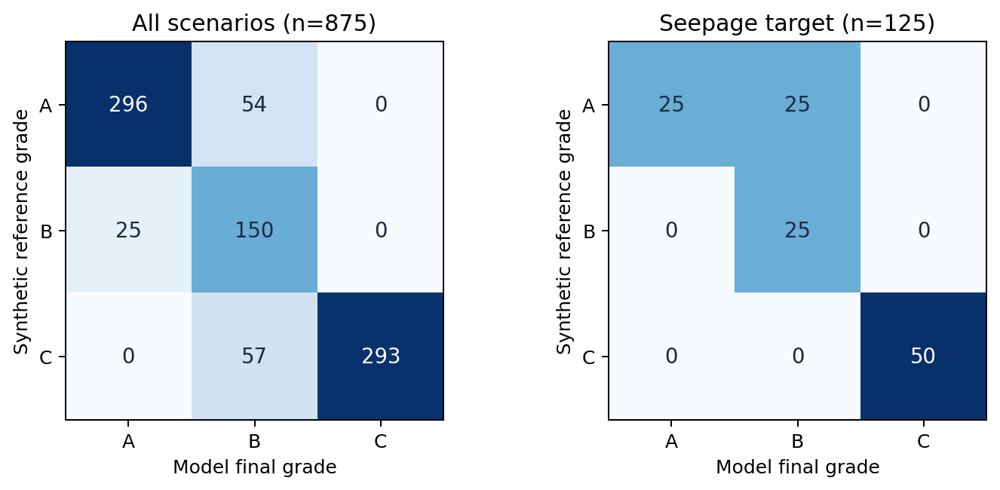

# 第6章第一阶段：资料审计与875合成样本基线

版本：2026-09-27。对应执行脚本为 `audit_875.py`、`audit_k45500.py`；所有生成物位于“分析工作区”，原资料未改动。

## 1. 数据与版本冻结

`875样本模型测试资料包`及`补充资料`共登记93个非缓存提取文件，并登记两个原始RAR包，合计95项。路径、大小、原始字节SHA-256和角色见[`875基线分析/原始文件清单.csv`](875基线分析/原始文件清单.csv)。清单中的“indexed”表示已清点及散列，**不表示逐份完成内容核读**。资料包括方法说明、源码、JSON/CSV和图；本文所用关键文件均另在下文定位。

以随机种子20260616在独立目录运行交付的生成脚本，重新生成的输入JSON、结果JSON、扁平CSV、摘要JSON和前五贡献CSV与交付目录**逐文件字节一致**，哈希见[`875基线分析/复现文件比对.json`](875基线分析/复现文件比对.json)。因此当前统计针对同一875基线版本，而不是前期`research/transparent_eval`试验入口。原版两份`failure_response_barrier_model.py`（875与历史案例）字节一致；历史案例版`safety_evaluation.py`增加了“已确认管涌或渗漏则C3=0”的分支，其余差异见[`K45+500追溯/safety_evaluation.py.diff`](K45+500追溯/safety_evaluation.py.diff)。前期`research`是另一套研究原型，不能混写为交付模型。

三个结果文件均有875个唯一桩号，ID集合完全相同，模式、严重程度和输出等级逐条一致。7类目标情景×5级严重程度共35个组合，各25条。参考等级按生成规则由严重程度确定：safe/slight为A、moderate为B、severe/critical为C。标签先于模型输出，但输入与标签共享情景设计，**只称合成参考等级，不称独立工程真值**。输入JSON只保存`section`，没有完整保存另行生成的`geo_cls`、建筑物、巡检证据；复现依赖生成程序。

去掉桩号与情景标签后，875个`section`载荷有777种不同内容，部分组合重复很高（如`safe_reference/safe`与`building/safe`各25条完全相同；`building/slight`、`building/moderate`也各只有1种载荷）。这个数字只刻画已存`section`，不包括另行生成的巡检或辅助地质输入，不能解释为777个独立工程样本。各组合载荷数写在[`875基线分析/875统计摘要.json`](875基线分析/875统计摘要.json)。

## 2. 总体分级结果

行是合成参考、列是最终输出A/B/C：

| 参考\输出 | A | B | C | 合计 |
|---|---:|---:|---:|---:|
| A | 296 | 54 | 0 | 350 |
| B | 25 | 150 | 0 | 175 |
| C | 0 | 57 | 293 | 350 |

一致率739/875=84.46%，宏平均F1=0.8272，平衡准确率=0.8467。A/B/C召回率依次为84.57%、85.71%、83.71%；精确率依次为92.21%、57.47%、100%。57/350个参考C输出B，是本批的严重等级低估；54/350个参考A输出B，是风险等级高估。136个误差都跨1级，A与C没有直接互判。这里的“低估/高估”是**相对合成参考标签**的方向，不代表真实灾害漏报率。逐条信息见[`875基线分析/136条误分类溯源.csv`](875基线分析/136条误分类溯源.csv)。

## 3. 误差集中位置

只有7个模式×严重度组合出现误分类：

| 情景/严重程度 | 参考→输出 | 数量 | 分数区间 | 首要核查点 |
|---|---|---:|---:|---|
| safe_reference / moderate | B→A | 25 | 89.7873–90.1027 | 安全基准模式中等标签与输入是否相容 |
| safe_reference / severe | C→B | 25 | 80.0697–80.1655 | 分数刚过A阈值但物理门控降至B，仍未到参考C |
| overtopping / severe | C→B | 25 | 64.1285–65.9319 | 超高亏欠分档只触发B上限 |
| seepage / slight | A→B | 25 | 75.5555–76.3144 | 轻微渗流与A/B分数阈值的语义差异 |
| slope / severe | C→B | 7 | 61.3996–63.8278* | 坡稳门控B/C界限及扰动值 |
| scour / slight | A→B | 4 | 93.6218–95.9719* | 冲刷分档/门控是否过严 |
| mixed / slight | A→B | 25 | 68.4883–69.7592 | 复合小幅不利叠加的分数效应 |

\*此处为该组合全部25条的分数区间，非仅误分类子集。逐组合A/B/C个数、正确数和完整范围以[`875基线分析/35组合分层统计.csv`](875基线分析/35组合分层统计.csv)为准。

纯渗流125条正确100条；25处失配全部是slight参考A而输出B，严重及临界各25条均输出C。`safe_reference`正确75/125，其中moderate全部输出A、severe全部输出B，应优先审查标签生成语义，不能直接把全部50条归咎于评价器。`safe_reference`的严重和临界样本会修改断面宽度、沉降、护坡/隐患、渗透比降和FoS，因而也不能简单称为“无风险样本”。

按代码阶段回查七个失配组合：`safe_reference/moderate`为25条原始A且无门控；`safe_reference/severe`为25条原始A经A5沉降门控变B；`overtopping/severe`为25条原始B保持B（B1及A5规则被记录但不再降级）；`seepage/slight`为25条原始B保持B；`slope/severe`的7条原始B保持B，虽记录D1、D2、A5门控；`scour/slight`的4条原始A经D3门控变B；`mixed/slight`为25条原始B保持B，其中12条记录D3但未进一步降级。因此大多数失配不是某个门控“将正确结论改错”，而是分数级与合成标签本来不一致，或B级门控不足以达到预设C级。是否应改标签或改判据须结合物理语义判断，不能根据该矩阵直接调参。

## 4. 得分、观测与硬约束门控

原始得分等级仅与参考等级一致450/875（51.43%）；`UAV门控后等级`与原始等级逐条相同。最终硬约束门控使322条等级改变，其中293条由原先失配变为一致，4条由一致变为失配，剩余25条等级虽变但仍失配。最终正确739条。该统计说明**此生成规则下最终分级高度依赖硬约束门控**，而不是证明门控在真实工程中提升了33个百分点。观察证据虽经C3等通道影响原始评分，本批`UAV门控等级上限`未额外改变任何一条等级；不能据此断言巡检无用，需做输入作用路径和配对消融。阶段矩阵及门控计数见统计摘要。

已完成第一组配对消融，原版完整输出逐条与交付结果一致。关闭UAV等级上限没有改变任何一条分数、等级或主控模式；将C3设为无异常锚点使150条分数改变（0至+1.3855分）、8条主控模式切换，但原始和最终等级均未改变；两项同时调整与单独调整C3相同。逐条四组记录与摘要见[`875观测通道消融`](875观测通道消融)目录。该实验只隔离既有通道，C3=100表示**假设无异常**，不是观测缺失，不能据此推出缺失巡检的安全性。

七类误差的正式机制归因仍需逐条基于触发原因/输入阈值判定。目前可验证的是落点和阶段作用；上表“首要核查点”是后续核查问题，**不是已确证的因果归因**。

## 5. K45+500案例的当前证据边界

29项取值表与交付结果JSON逐项核对，A8、A9、B2、D5在表中为100，而JSON中为`null`并列入缺失项，见[`K45+500追溯/指标得分冲突.csv`](K45+500追溯/指标得分冲突.csv)及完整[`K45+500追溯/29指标证据台账.csv`](K45+500追溯/29指标证据台账.csv)。同一JSON另有A4、B3、B4、C2、C6、D4、E1–E5等缺失项；缺失与不适用未完全分离。A3以100分表示不涉及，容易与检测合格混淆。A5、D5所涉沉降为代表取值，不是2017同步实测。D3冲刷深度0.40m的来源仍需定位。

交付JSON给出35.90m代表高水位、深层黏土控制比1.04484、堤基出口区砂层比0.40992、背水坡FoS 1.15543、综合分24.3481、C级及渗流主控。35.90m不是2017年同刻实测；K45+500位于2017年管涌范围，不等于确切出险点。交付案例已将历史管涌事实写入C3=0及其他描述，因此“C级与历史险情一致”不能当成独立盲测正确率。C1把深层黏土最大比值用于堤基管涌临界门控的物理适用性，及C5接触带的控制层选取，均需领域复核。

脚本`run_k45500_historical_case.py`引用本批未交付的`补充资料/验证剖面3/beiyong_fixed3.py`与`补充资料/safe`输入，故此阶段仅分析交付结果，**未重跑物理求解**。历史案例与875基线的评分代码分支不同，代码哈希和差异见版本登记。下一步可整理输入并尝试只重放评价层；在冲突及缺失策略明确前，不通过调值强行匹配24.3481。

## 6. 下一步分析顺序

1. 冻结完整实验协议：原版结果与候选方法分开；先逐条判定136处失配机制，再构造固定其他输入的成对单调序列。
2. 补做物理—巡检冲突、观测通道消融和缺失压力测试；同时报告输出覆盖率与错误安全结论率。
3. 审计现有敏感性CSV，对等级稳定和主控模式稳定分别计数；后做预定范围的联合扰动。
4. 案例在明确29项冲突和时空适用性后进行评价层重放；物理复算及现场外部验证等待对应源数据。

本报告所有百分比与矩阵只适用于固定生成器和固定种子的受控合成样本。工程水位、阈值和规范条文尚需逐项核验，不能将这里的分数解释为校准的失效概率。
